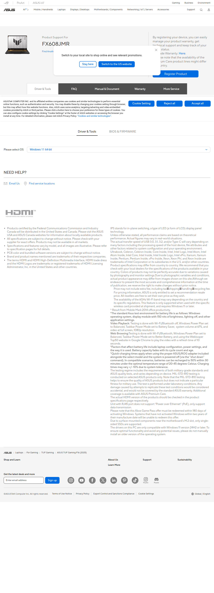

# Visited: https://www.asus.com/Laptops/For-Gaming/TUF-Gaming/ASUS-TUF-Gaming-F16-2025/HelpDesk_Download/?model2Name=FX608JMR
**Time:** Sun May  3 16:57:42 UTC 2026

## Screenshot

## Raw HTML
[page.html](./page.html)

## Downloaded Media (7 files)
## Downloaded Media Files

## Other Links
- [#](#)
- [//www.asus.com/support/Product/ContactUs/Services/questionform/?lang=en](//www.asus.com/support/Product/ContactUs/Services/questionform/?lang=en)
- [//www.googletagmanager.com/ns.html?id=GTM-NJRLM8](//www.googletagmanager.com/ns.html?id=GTM-NJRLM8)
- [/_nuxt/047070428.css](/_nuxt/047070428.css)
- [/_nuxt/09b730428.js](/_nuxt/09b730428.js)
- [/_nuxt/0d8f70428.css](/_nuxt/0d8f70428.css)
- [/_nuxt/12d010428.js](/_nuxt/12d010428.js)
- [/_nuxt/1486d0428.js](/_nuxt/1486d0428.js)
- [/_nuxt/19f120428.js](/_nuxt/19f120428.js)
- [/_nuxt/379390428.css](/_nuxt/379390428.css)
- [/_nuxt/427c60428.js](/_nuxt/427c60428.js)
- [/_nuxt/42c4c0428.css](/_nuxt/42c4c0428.css)
- [/_nuxt/46bc60428.css](/_nuxt/46bc60428.css)
- [/_nuxt/481560428.css](/_nuxt/481560428.css)
- [/_nuxt/4a7ad0428.js](/_nuxt/4a7ad0428.js)
- [/_nuxt/5ad920428.css](/_nuxt/5ad920428.css)
- [/_nuxt/62e510428.css](/_nuxt/62e510428.css)
- [/_nuxt/6544b0428.js](/_nuxt/6544b0428.js)
- [/_nuxt/671980428.css](/_nuxt/671980428.css)
- [/_nuxt/69a220428.css](/_nuxt/69a220428.css)
- [/_nuxt/7c5860428.css](/_nuxt/7c5860428.css)
- [/_nuxt/842980428.js](/_nuxt/842980428.js)
- [/_nuxt/88c6d0428.css](/_nuxt/88c6d0428.css)
- [/_nuxt/8fef00428.js](/_nuxt/8fef00428.js)
- [/_nuxt/91cbf0428.js](/_nuxt/91cbf0428.js)
- [/_nuxt/9bad40428.js](/_nuxt/9bad40428.js)
- [/_nuxt/a014a0428.js](/_nuxt/a014a0428.js)
- [/_nuxt/a0b600428.js](/_nuxt/a0b600428.js)
- [/_nuxt/a255e0428.js](/_nuxt/a255e0428.js)
- [/_nuxt/app-c1e810428.js](/_nuxt/app-c1e810428.js)
- [/_nuxt/b6b210428.css](/_nuxt/b6b210428.css)
- [/_nuxt/c5a520428.js](/_nuxt/c5a520428.js)
- [/_nuxt/c8ab50428.js](/_nuxt/c8ab50428.js)
- [/_nuxt/c9e8f0428.js](/_nuxt/c9e8f0428.js)
- [/_nuxt/d03fa0428.css](/_nuxt/d03fa0428.css)
- [/_nuxt/d78720428.js](/_nuxt/d78720428.js)
- [/_nuxt/e37300428.css](/_nuxt/e37300428.css)
- [/_nuxt/ed1090428.js](/_nuxt/ed1090428.js)
- [/_nuxt/efb340428.css](/_nuxt/efb340428.css)
- [/_nuxt/f74450428.css](/_nuxt/f74450428.css)
- [/_nuxt/f94b00428.js](/_nuxt/f94b00428.js)
- [/nuxtStatic/js/jquery.min.js](/nuxtStatic/js/jquery.min.js)
- [/nuxtStatic/js/overview.js](/nuxtStatic/js/overview.js)
- [https://cdn.fonts.net](https://cdn.fonts.net)
- [https://cdn.fonts.net/kit/9d6c4993-7af8-42eb-aef7-5ba3591e71b6/9d6c4993-7af8-42eb-aef7-5ba3591e71b6_enhanced.css](https://cdn.fonts.net/kit/9d6c4993-7af8-42eb-aef7-5ba3591e71b6/9d6c4993-7af8-42eb-aef7-5ba3591e71b6_enhanced.css)
- [https://cdn.fonts.net/kit/9d6c4993-7af8-42eb-aef7-5ba3591e71b6/9d6c4993-7af8-42eb-aef7-5ba3591e71b6_enhanced.js](https://cdn.fonts.net/kit/9d6c4993-7af8-42eb-aef7-5ba3591e71b6/9d6c4993-7af8-42eb-aef7-5ba3591e71b6_enhanced.js)
- [https://discord.gg/zvsdMkpuhb](https://discord.gg/zvsdMkpuhb)
- [https://dlcdnimgs.asus.com/vendor/public/fonts/js/roboto.js](https://dlcdnimgs.asus.com/vendor/public/fonts/js/roboto.js)
- [https://dlcdnimgs.asus.com/vendor/subscribe-form/js/subscribeform.min.js](https://dlcdnimgs.asus.com/vendor/subscribe-form/js/subscribeform.min.js)
- [https://dlcdnwebimgs.asus.com/gain/31e66910-e008-4967-a713-e53943f372cf/w300/fwebp](https://dlcdnwebimgs.asus.com/gain/31e66910-e008-4967-a713-e53943f372cf/w300/fwebp)

## Stats
- Links: 192
- Media: 7
