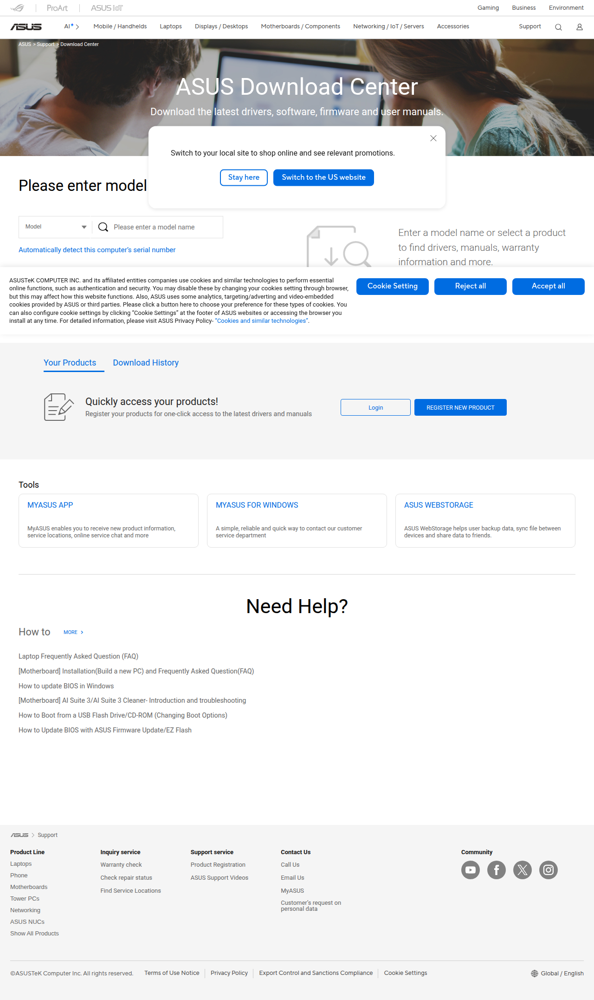

# Visited: https://www.asus.com/support/download-center/
**Time:** Fri May  1 22:56:36 UTC 2026

## Screenshot

## Raw HTML
[page.html](./page.html)

## Downloaded Media (0 files)
_No media files downloaded_

## Other Links
- [/support/public/css/reset.css](/support/public/css/reset.css)
- [/support/public/javascripts/slick/slick-theme.css](/support/public/javascripts/slick/slick-theme.css)
- [/support/public/javascripts/slick/slick.css](/support/public/javascripts/slick/slick.css)
- [/support/stylesheets/main.css](/support/stylesheets/main.css)
- [https://dlcdnimgs.asus.com/vendor/location-reminder/js/locationreminder.min.js](https://dlcdnimgs.asus.com/vendor/location-reminder/js/locationreminder.min.js)
- [https://dlcdnimgs.asus.com/vendor/public/fonts/js/roboto.js](https://dlcdnimgs.asus.com/vendor/public/fonts/js/roboto.js)
- [https://www.asus.com/API/js/asus_config.min.js](https://www.asus.com/API/js/asus_config.min.js)
- [https://www.asus.com/nuxtStatic/js/jquery.min.js](https://www.asus.com/nuxtStatic/js/jquery.min.js)
- [https://www.asus.com/support/download-center/](https://www.asus.com/support/download-center/)
- [https://www.googletagmanager.com/ns.html?id=GTM-NJRLM8](https://www.googletagmanager.com/ns.html?id=GTM-NJRLM8)

## Stats
- Links: 10
- Media: 0
